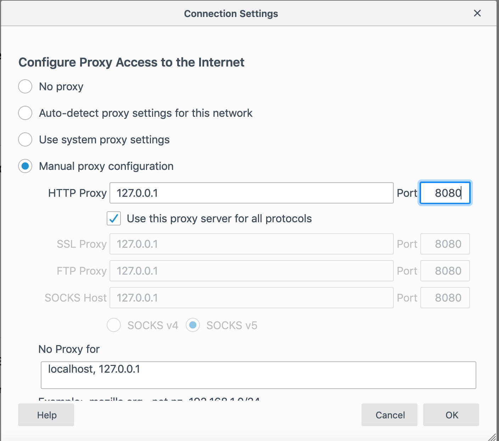
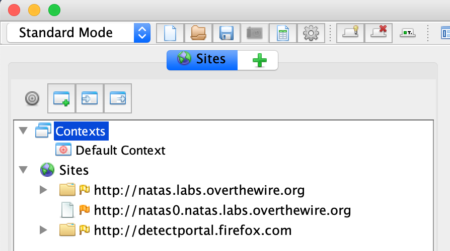

# OverTheWire.org: Natas

This contains a series of writeups for the [Natas wargame](http://overthewire.org/wargames/natas/natas0.html). View the markdown files by level.

## Setup

For these writeups, I'll use the [OWASP Zed Attack Proxy](https://www.owasp.org/index.php/OWASP_Zed_Attack_Proxy_Project) with [Firefox](https://getfirefox.com/). I think that zaproxy is garbage compared to [Burp Suite Professional](https://portswigger.net/burp/) but as it is free it is better to use for this wargame. Install ZAP and Firefox, and set Firefox to use `localhost:8080` as its proxy:

Navigate to `http://natas0.natas.labs.overthewire.org/` in Firefox, and you should see it in ZAP. The username
and password are both `natas0`. You'll see the domain appear in the ZAP history if it works.

At this point, everything is working.