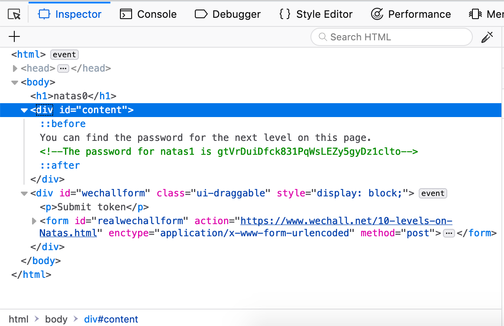

# natas0 -> natas1

To get to level 1, we have to find the flag which is "on this page".

Let's just inspect the page. It exists as a comment in "content":



## Exploit

Um, pull the flag from the comment. But really, if you must, run this in the
developer console:

```js
let html = document.getElementById('content').innerHTML;
let flag = html.substr(html.indexOf('natas1 is')+10, 32).trim();
console.log('the password is ' + flag);
```


## The flag

gtVrDuiDfck831PqWsLEZy5gyDz1clto

You can use this to log in as `natas1` on `http://natas1.natas.labs.overthewire.org/`.