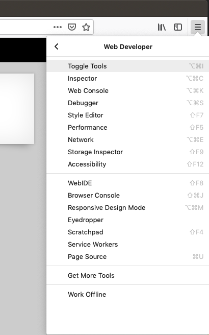

# natas1 -> natas2

Getting to the level after this is pretty much just as easy. While right clicking
is disabled, you can just open the developer tools and nab the flag from the
browser menu instead:



## Exploit

Reuse a modified version of the "exploit" from natas0:

```js
let html = document.getElementById('content').innerHTML;
let flag = html.substr(html.indexOf('natas2 is')+10, 32).trim();
console.log('the password is ' + flag);
```

## The flag

`ZluruAthQk7Q2MqmDeTiUij2ZvWy2mBi`

You can use this to log in as `natas2` on `http://natas2.natas.labs.overthewire.org/`.