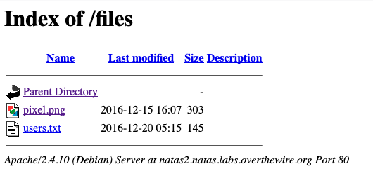

# natas2 -> natas3

So there's nothing on this page, it says. Let's use the same trick we've been
using, and see if there are any clues as to what is going on:

So there *is* something on this page - a pixel.png in the `files` directory. If we view the PNG, in ZAP, it really is just a PNG.

What does the directory `files/` itself contain? A juicy `users.txt` file:

Opening this file gives us our next flag, in a nice easy to read plaintext format.

## Problems

* [CWE-862: Missing Authorization](https://cwe.mitre.org/data/definitions/862.html)
* [CWE-538: File and Directory Information Exposure](https://cwe.mitre.org/data/definitions/538.html)

## Remediation

1. `users.txt` shouldn't be stored here, or in plaintext.
2. [Turn off directory browsing.](https://stackoverflow.com/questions/2530372/how-do-i-disable-directory-browsing)

## The flag

`sJIJNW6ucpu6HPZ1ZAchaDtwd7oGrD14`

