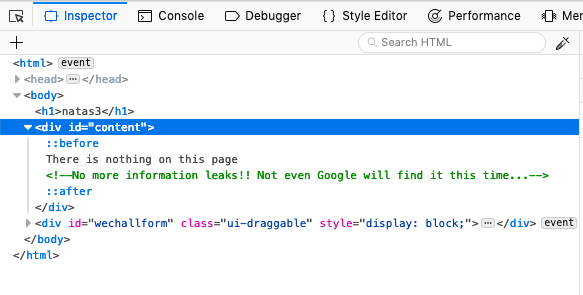
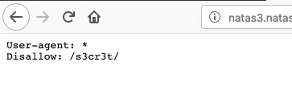
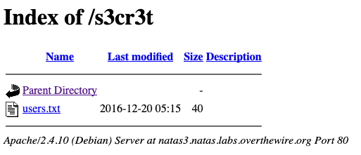

# natas3 -> natas4

We now have a pattern going. Check the comment here, and it says "not even Google will find it this time".

With this hint, ask yourself: what does Google read? Most search engines will try to read `robots.txt` in the root directory. So let's try that and see what we get:

Here we can see that we don't want the directory `/s3cr3t/` to be indexed by Google. Why? Let's navigate to that directory:

Oh, this again. The flag exists inside of `users.txt`.

## Problems

* [CWE-862: Missing Authorization](https://cwe.mitre.org/data/definitions/862.html)
* [CWE-538: File and Directory Information Exposure](https://cwe.mitre.org/data/definitions/538.html)
* [CWE-425: Forced Browsing](https://cwe.mitre.org/data/definitions/425.html)

## Remediation

Don't trust `robots.txt`. You'd be surprised what you can find in here - usually login pages, statistics files, etc. You can use this to hide from search engines, but not humans. Gate everything you don't want accessible with a strong auth method.

## The flag

`Z9tkRkWmpt9Qr7XrR5jWRkgOU901swEZ`