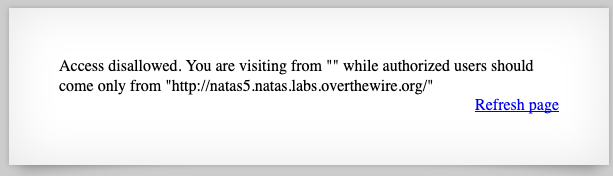
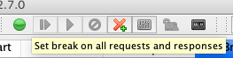
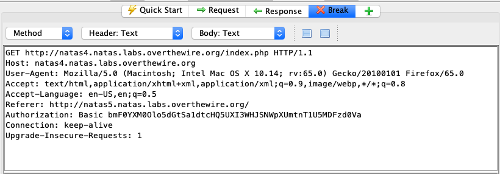

# natas4 -> natas5

We've been presented with a new prompt:

This script is gating us upon the HTTP Referer header. Finally, we'll get to use ZAP. Turn on HTTP breakpoints by clicking the green circle:

Then, click the "Refresh Page" link. Note we will have a `Referer` header in the HTTP Request. Let's change this to be `http://natas5.natas.labs.overthewire.org/` since that is what it seems to want, and see what we get as the response. Note the modified `Referer` below.

Sending this along gets us the next flag.

## Problems

* [CWE-285: Improper Authorization](https://cwe.mitre.org/data/definitions/285.html)

## Remediation

Don't trust input from HTTP headers to not be forged. It is trivial for a user to change any part of the request being sent to you. If you do not have a verification method on your end, assume it is insecure.

## The flag

`iX6IOfmpN7AYOQGPwtn3fXpbaJVJcHfq`
