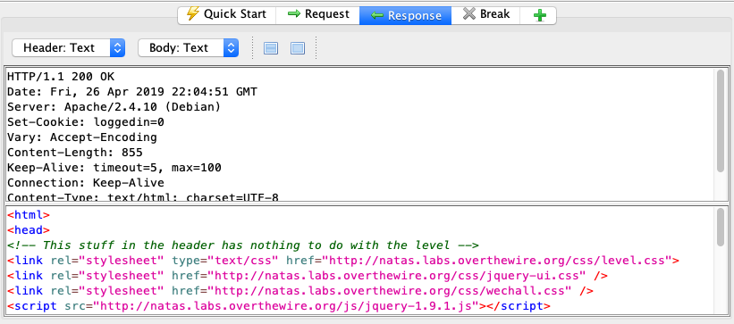
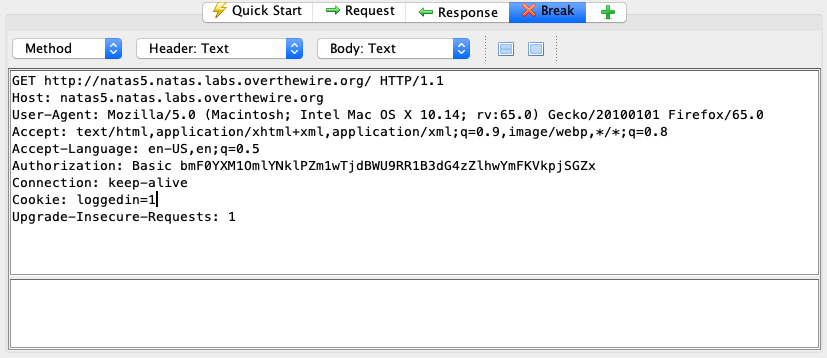

# natas5 -> natas6

Now, it tells us that "we are not logged in." Uh, OK. So what is logging us in? Let's look at the HTTP response that came back in ZAP.

Note that this time, the server set a cookie using `Set-Cookie`, where `loggedin=0`. If we send a request to this site now, the cookie will be `loggedin=0`. Let's just forge the cookie to be loggedin=1 on the next request we make in ZAP:

Sending this along gets us the next flag.

## Problems

* [CWE-302: Authentication Bypass by Assumed-Immutable Data](https://cwe.mitre.org/data/definitions/302.html)

## Remediation

Don't trust what you set in cookies to be the same when they come back to you. Remember in natas4, we talked about this being a problem in HTTP headers. If the user controls it, and you don't check its integrity, it can be modified.

## The flag

`aGoY4q2Dc6MgDq4oL4YtoKtyAg9PeHa1`