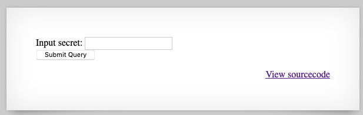
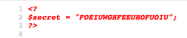

# natas6 -> natas7

We are given an input box and some PHP source:



The source code in this page that does this check is as follows:

```php
include "includes/secret.inc";

if(array_key_exists("submit", $_POST)) {
    if($secret == $_POST['secret']) {
        print "Access granted. The password for natas7 is <censored>";
    } else {
        print "Wrong secret";
    }
}
```

Here we get to understand that making a `POST` request, we check for the "submit" field to equal the secret `$secret`. However, `$secret` isn't set in this context, and is probably coming in from `includes/secret.inc`.

So what happens if we keep up the forced-browsing thing and just go straight to `includes/secret.inc`?



Oh, well that was easy. Now that we have the credential we need, we can submit it in the form. Copy/paste `FOEIUWGHFEEUHOFUOIU` into the form, and we'll get the flag.

## Problems

* [CWE-540: Information Exposure through Source Code](http://cwe.mitre.org/data/definitions/540.html)

## Remediation

In this case, we are including a PHP file with the `.inc` suffix. This isn't being sent through the PHP interpreter by Apache, and thus it just gets dumped to us as a plaintext file. Server misconfiguration like this is surprisingly common, and it has hit a lot of large companies leading to source code leakage, not just secrets.

It's better to just keep [important scripts outside the web root](https://stackoverflow.com/questions/2382695/placing-php-script-outside-website-root).

## The flag

7z3hEENjQtflzgnT29q7wAvMNfZdh0i9

