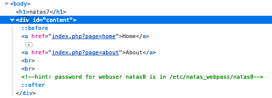
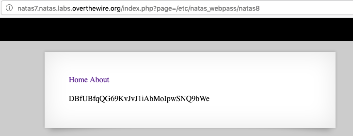

# natas7 -> natas8

In natas7, we are presented with a document that contains links to `home` and `about`.


If we inspect the page, these links are dynamic, with a GET query string input to page, and a hint:



The hint here makes it easy. This is likely path traversal. While we don't have the code, we can assume that index.php is doing something like:

```php
    echo get_file_contents($_GET['page']);
```

If this is what it is doing, we can read a whole lot of files on the filesystem simply by changing `page` to be a full path to the file we want to read. Since they have given us a hint, let's use `/etc/natas_webpass/natas8`, and we'll get the flag.



> Note you can read other files here too, such as `/etc/passwd`.

## Problems

* [CWE-22: Improper Limitation of a Pathname to a Restricted Directory](https://cwe.mitre.org/data/definitions/22.html)

## Remediation

Sanitize user input of path delimiters. See [this article on OWASP](https://www.owasp.org/index.php/File_System#Path_traversal).

## The flag

`DBfUBfqQG69KvJvJ1iAbMoIpwSNQ9bWe`.