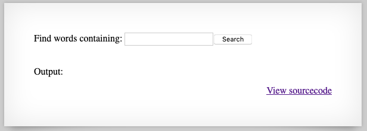

# natas9 -> natas10

Here we are presented with strange functionality that appears to search a dictionary.



The source code used here is as follows:

```php
$key = "";

if(array_key_exists("needle", $_REQUEST)) {
    $key = $_REQUEST["needle"];
}

if($key != "") {
    passthru("grep -i $key dictionary.txt");
}
```

Our search form uses the query string `needle` to search. The way it is searching is by interpolating `$needle` into `grep` using the [passthru](https://www.php.net/manual/en/function.passthru.php) command. `passthru` spawns a shell, so what we have actually been given here is a critical [command injection vulnerability](https://www.owasp.org/index.php/Command_Injection). We can execute code as the shell running the PHP process. Using a string such as `; echo "foo";` will write to the shell `grep -i; echo "foo; dictionary.txt` and execute our arbitrary `echo "foo" command.

## Exploit

Knowing this we can craft an exploit string and get the flag returned to us. Just enter this string into the field, no ZAP necessary:

`; cat /etc/natas_webpass/natas10;`

## Problems

* [CWE-78: Improper Neutralization of Special Elements used in an OS Command ('OS Command Injection')](http://cwe.mitre.org/data/definitions/78.html)

## Remediation

Sanitize input. There's pretty much never a good reason to call out to a shell and hand it user input of any sort.

## The flag

`nOpp1igQAkUzaI1GUUjzn1bFVj7xCNzu`